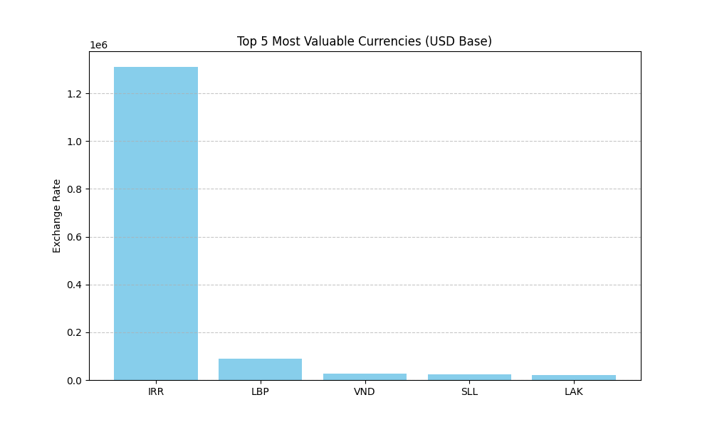

# 📈 Daily Currency Pipeline Dashboard

This project is a fully automated end-to-end data engineering pipeline. It runs every night (UTC), pulling live financial data, analyzing it with SQL, and updating the dashboard below.

### 📊 Live SQL Insights: Top 5 Currencies

*(The chart above updates automatically every 24 hours.)*

---

## Project Overview

This project automates the collection and transformation of financial data using Python and GitHub Actions. It eliminates manual data entry by fetching real-time rates and storing them in a structured CSV "Data Lake," which is then loaded into a local SQL Data Warehouse (SQLite) for analysis.

### 🛠️ Tech Stack

* **Language:** Python 3.9
* **Libraries:** Pandas, Requests, Matplotlib
* **Data Warehouse:** SQLite (SQL)
* **Automation:** GitHub Actions (CI/CD)
* **Storage:** CSV / Git

### 🔄 How It Works

This complete **ETL (Extract, Transform, Load)** pipeline follows a professional workflow:

1.  **Extract:** A Python script connects to the Exchange Rate API to pull live data.
2.  **Load (Bronze):** Raw data is loaded into a time-stamped CSV "Data Lake."
3.  **Transform (Silver):** A Python-based **SQL Engine** (SQLite) merges the CSVs, groups by currency, and calculates analytical insights like average rate and volatility.
4.  **Visualize (Gold):** A final script reads the SQL results and generates a professional **bar chart dashboard** to visualize findings.
5.  **Automate:** GitHub Actions triggers the entire sequence every night at midnight (UTC) and commits all new data and the updated chart back to this repository.

### 📂 Repository Structure

* `/src`: Contains all Python scripts (Extraction, SQL, and Dashboard).
* `/data`: Automated storage for daily exchange rate CSVs ("Data Lake").
* `/reports`: Automate storage for the generated visualization charts.
* `/github/workflows`: The YAML configuration for the daily automated run.
* `exchange_warehouse.db`: The SQLite data warehouse file.

---
*(Keep your original Project 1 text from line 11 onwards below this, if you'd like to retain the original project history)*
